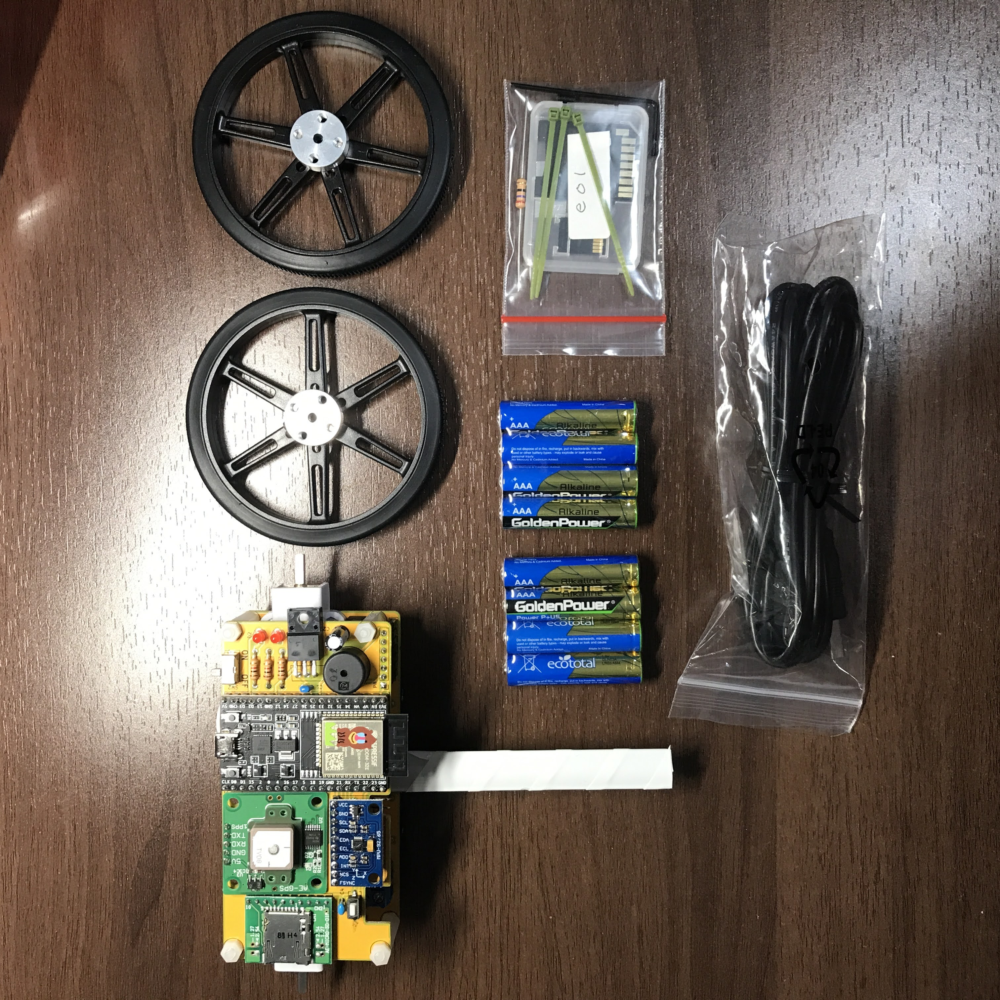

## 貸出機材について

講義で使用する機材の貸出を行います。

受講生のみなさんは機材が届いたら、内容物に過不足等ないか確認をお願いします。

貸出機材は講義終了後、事務局へ返却してもらいます。返却についてはその際にアナウンスします。

### 貸出機材一覧

|物品名|個数|備考|
|:---|---:|:---|
|cansat本体|1個||
|車輪|2個||
|USBケーブル microB to A|1本||
|microSDカード|1個||
|L字六角レンチ|1本||
|27Ω抵抗|1個||
|結束バンド|2本||
|乾電池|8本|使い終わった電池は受講生の方で捨ててください。返却の際に買い直す必要はありません。|

