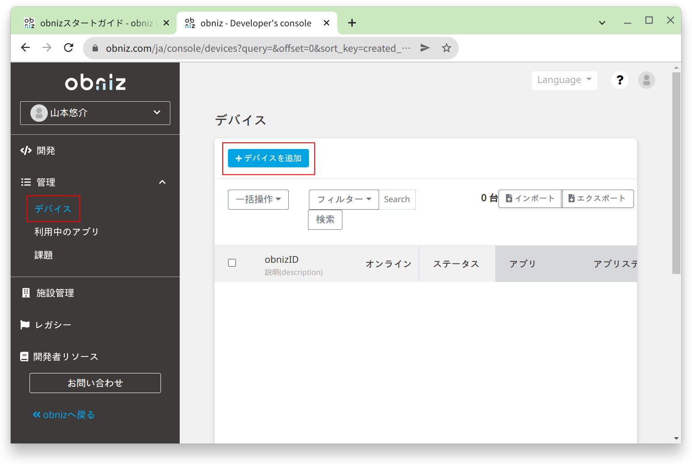
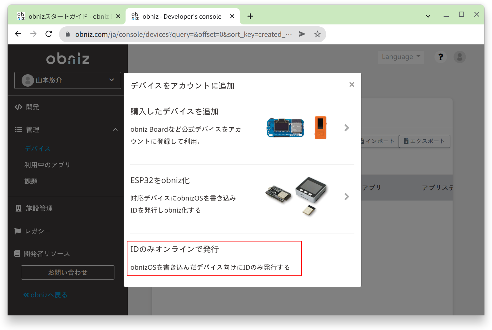
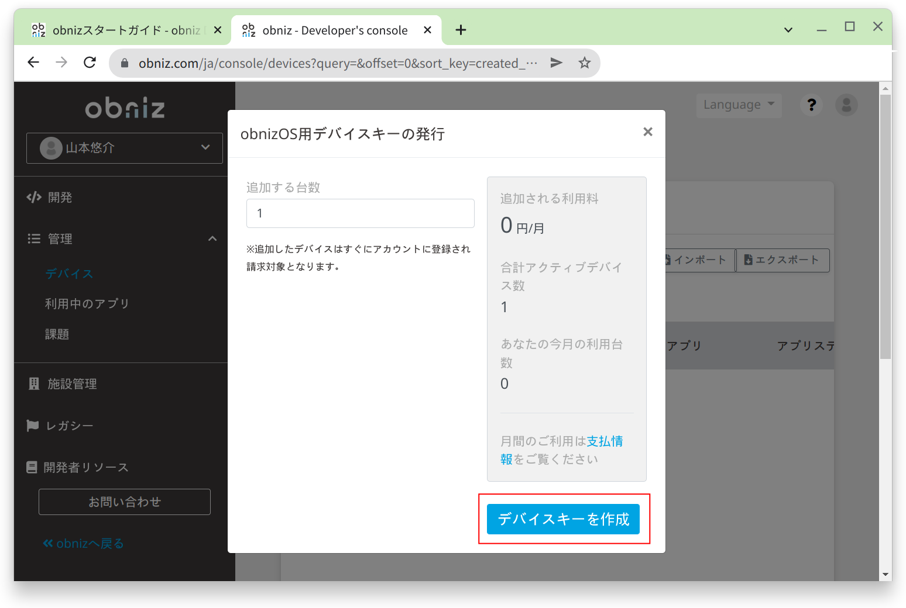
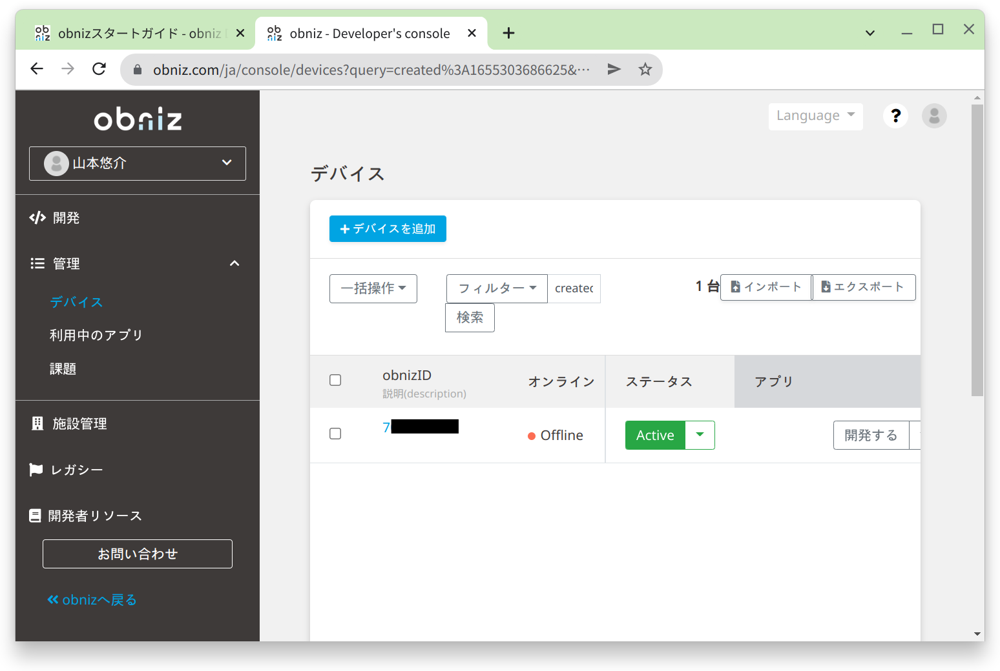
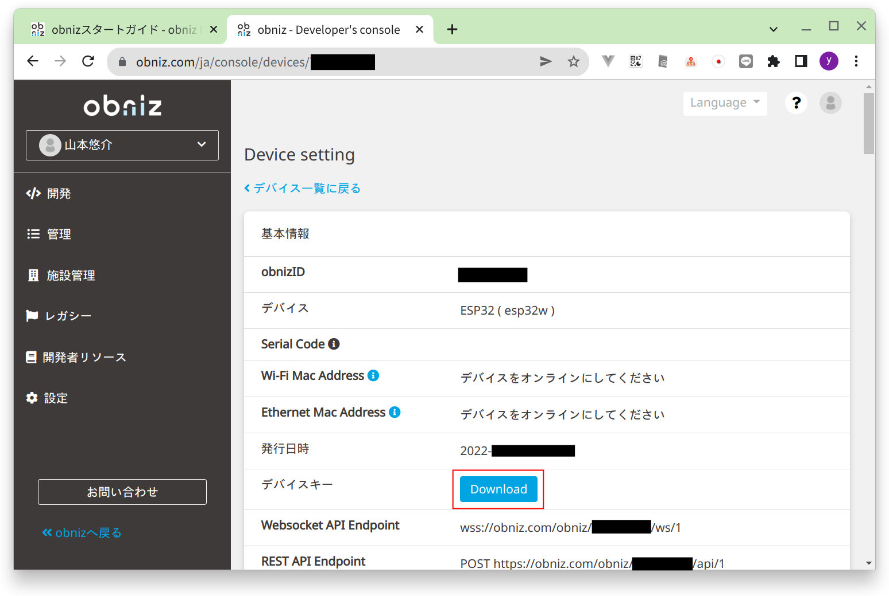

## デバイスの追加

obnizアカウントを作成したら、開発者コンソールの左メニューから「管理 > デバイス」を開きます。

「デバイスを追加」をクリックします。

「IDのみオンラインで発行」をクリックします。

「デバイスキーを作成」をクリックします。

デバイスが追加されました。

obnizIDをクリックすると、デバイスの詳細画面が開きます。

デバイスキーの項目にある「Download」をクリックしてデバイスキーをダウンロードします。

