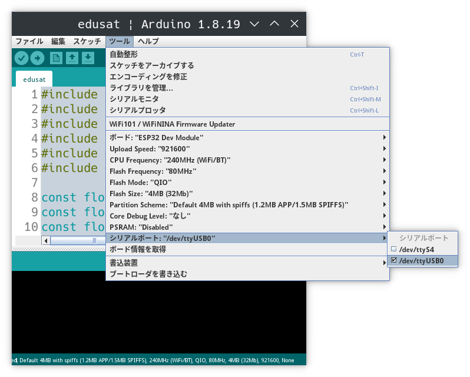
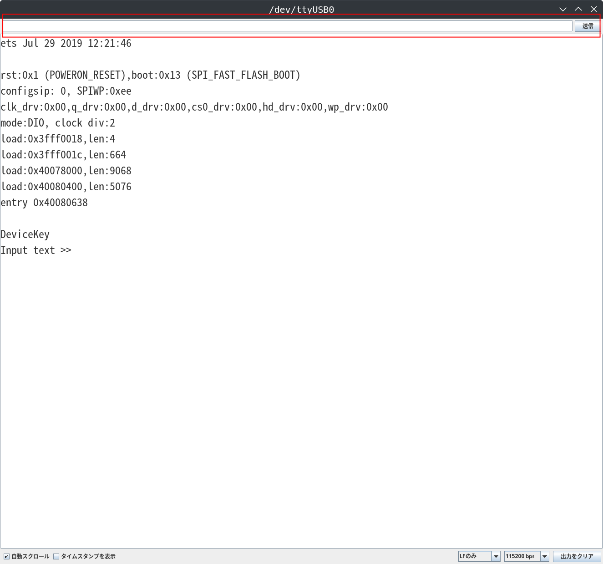
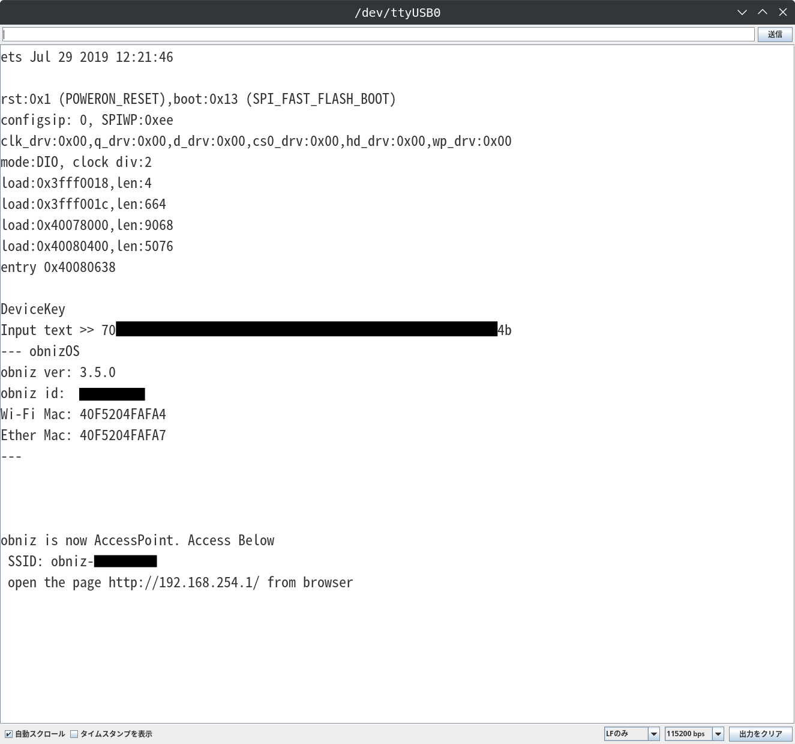
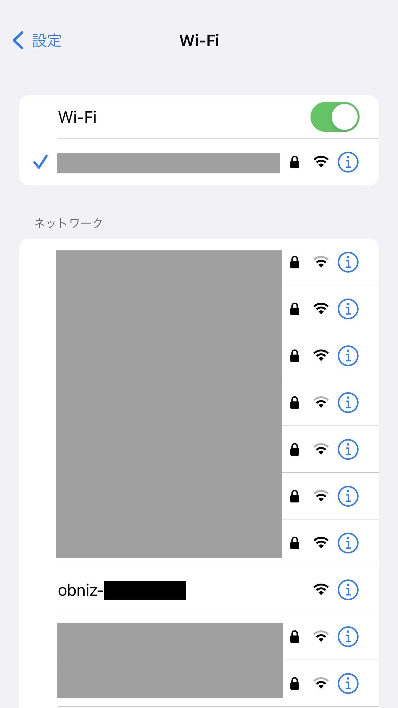
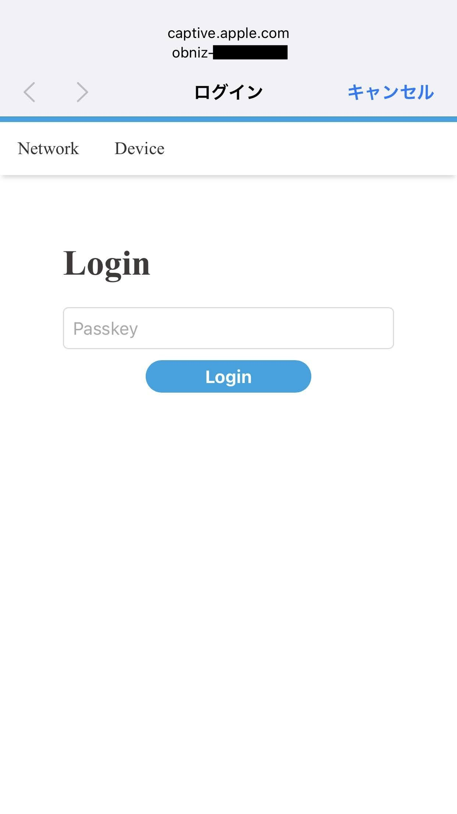
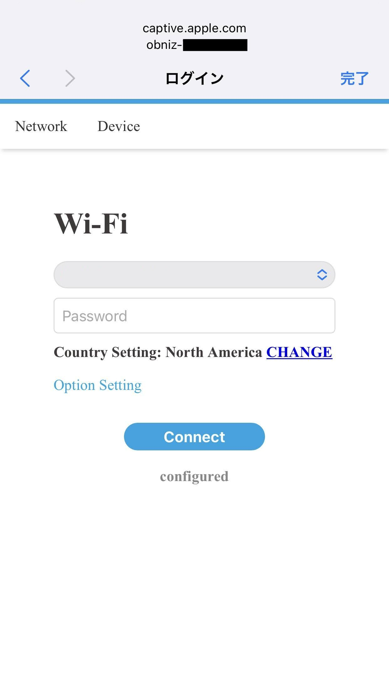
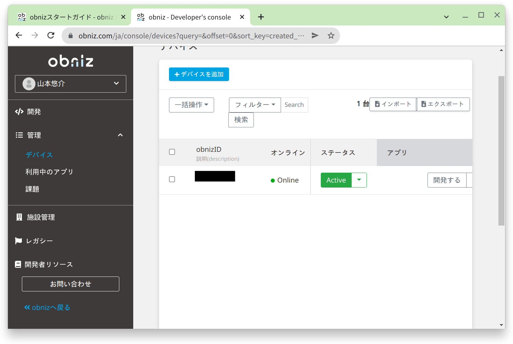

## デバイスの追加

obnizアカウントを作成したら、開発者コンソールの左メニューから「管理 > デバイス」を開きます。

「デバイスを追加」をクリックします。

「IDのみオンラインで発行」をクリックします。

「デバイスキーを作成」をクリックします。

デバイスが追加されました。

## デバイスキーの書き込み

開発者コンソールの「管理 > デバイス」を開き、デバイス一覧から追加したデバイスのobnizIDをクリックして、デバイスの詳細画面を開きます。

デバイスキーの項目にある「Download」をクリックしてデバイスキーをダウンロードします。

次にArduino IDEを起動します。

CanSatをUSBケーブルでPCに接続して、Arduino IDE上部メニューの「ツール > シリアルポート」からCanSatのポートを選択します。

「ツール > シリアルモニタ」からシリアルモニタを開きます。

シリアルモニタの画面下部からボーレートを「115200」に設定します。

CanSatのリセットボタンをクリックすると下記のように「Input text >>」と出力されます。

シリアルモニタ上部の入力欄にダウンロードしたデバイスキーを入力して「送信」をクリックします。

デバイスキーの書き込みが完了するとCanSatがWi-Fiのアクセスポイントとして起動します。

PCやスマホでCanSatのアクセスポイントに接続します。
接続時のパスキーは「obniz」です。

次に自宅のWi-Fi等に接続してオンライン状態にします。

接続が完了すると開発者コンソール上でデバイスの状態が「Online」になります。

