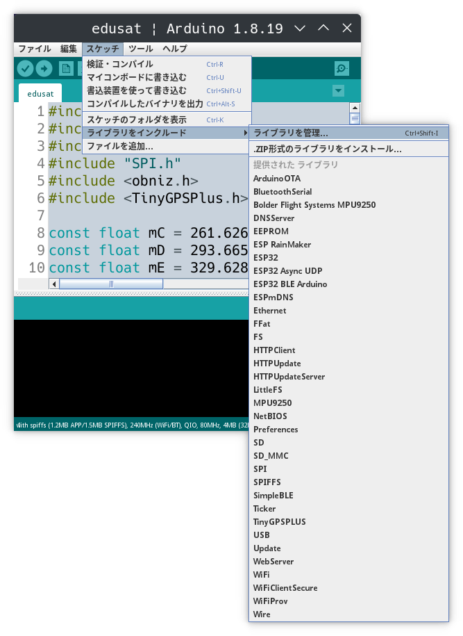
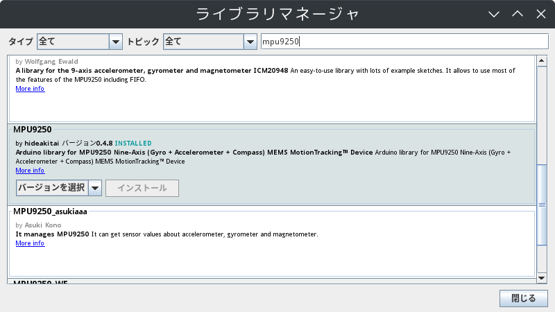
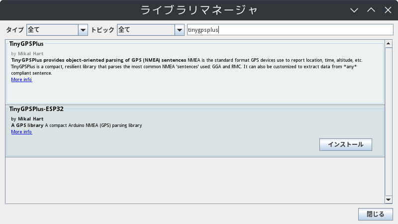
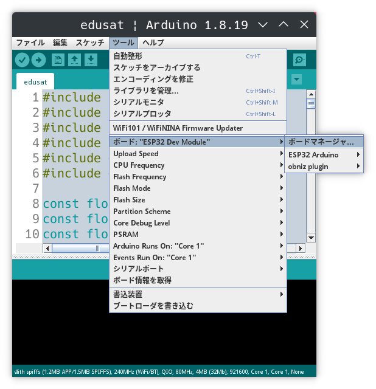
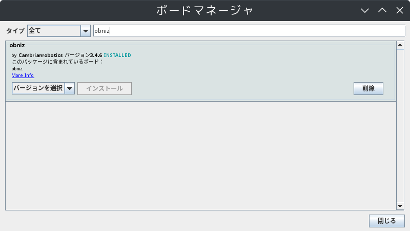
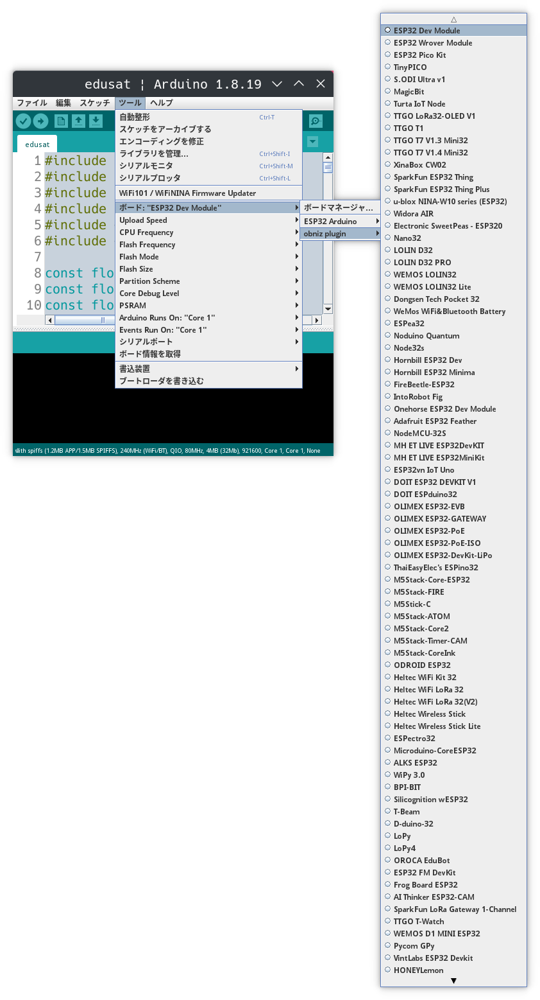

## 開発環境の設定

## Arduino IDEのインストール

[開発環境のセットアップ](https://100kinsat.github.io/posts/setup-the-development-environment/)を参考にしてください。

## ライブラリの追加

CanSatで使用する各センサ類のライブラリを追加します。
9軸センサ（`MPU9250.h`）とGPSセンサ（`TinyGPSPlus.h`）のライブラリを追加します。

Arduino IDEのメニューから「スケッチ > ライブラリをインクルード > ライブラリを管理」をクリックしてライブラリマネージャを開きます。

最初に9軸センサのライブラリをインストールします。
ライブラリマネージャの検索窓に「mpu9250」と入力します。
「by hideakitai」と書かれているライブラリを選んでインストールします。

次にGPSセンサのライブラリをインストールします。
ライブラリマネージャの検索窓に「tinygpsplus」と入力します。
「TinyGPSPlus」と書かれているライブラリを選んでインストールします。
 *(TinyGPSPlus-ESP32というESP32向けに開発されたものもあるようですが、動作確認しているものは無印の「TinyGPSPlus」方です。)*

インストールしたライブラリのサンプルプログラムはメニューの「ファイル > スケッチ例 > カスタムライブラリのスケッチ例」から開くことができます。

## ボードの追加

obnizOSのボードを追加します。

Arduino IDEのメニューから「ツール > ボード > ボードマネージャ」をクリックしてボードマネージャを開きます。

ボードマネージャの検索窓に「obniz」と入力します。
「by Cambrianrobotics」と書かれているボードを選んでインストールします。

インストールが完了すると「ツール > ボード」に「obniz plugin」が追加されます。
CanSatの開発では「obniz plugin > ESP32 Dev Module」を選択した状態で行います。

