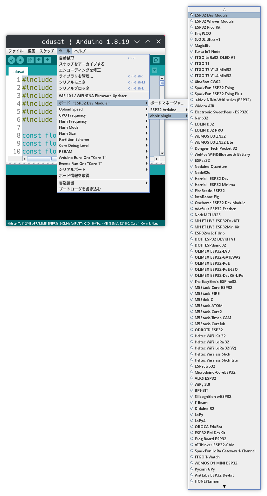
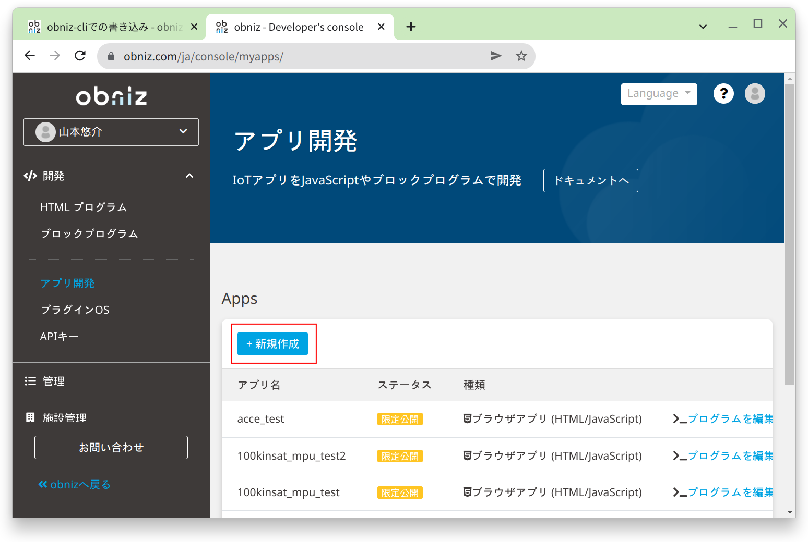

## サンプルプログラムを動かす

### 100kinSATにブログラムを書き込む

最初に、Arduino IDEで[edusat.ino](../../src/edusat/edusat.ino)を開きます。

次に、上部メニューの「ツール」から「ツール > ボード > obniz plugin > ESP32 Dev Module」を選択します。

100kinSATとPCをUSBケーブルで接続して、「ツール > シリアルポート」からシリアルポートを選択します。
Windowsであれば「COM3」のようなポートが表示されます。

最後に、「スケッチ > マイコンボードに書き込む」をクリックします。
プログラムがコンパイルされて、マイコンに実行ファイルが書き込まれます。

完了すると「ボードへの書き込みが完了しました。」とArduino IDEに表示されます。

### Obnizの操作

obnizの[開発者コンソール](https://obniz.com/ja/console)を開きます。

左メニューの「開発 > アプリ開発」をクリックしてアプリ開発の画面を開きます。

「新規作成」をクリックします。

「ESP32を使うテンプレート」から「空のプロジェクト」をクリックします。

アプリ名を入力して「アプリを作成」をクリックします。。
ここではアプリ名をsampleとしています。

新規作成したアプリの詳細画面が開くので、「プログラムを編集」をクリックして編集画面を開きます。

編集画面のHTMLコードが書かれているところに[`obniz.html`](../../src/edusat/obniz.html)をコピペします。

上部の実行をクリックすると、プログラムが実行されます。

サンプルプログラムでは100kinSATの状態と緯度・経度、ロール・ピッチ・ヨーの値が表示されます。
また、ロール・ピッチ・ヨーの値をもとに100kinSATの姿勢がイラストで描画されます。

