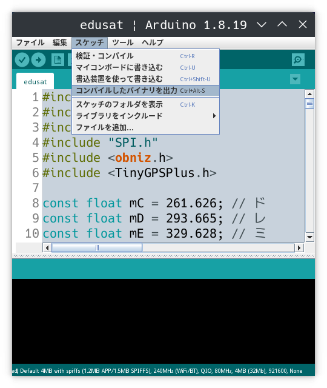
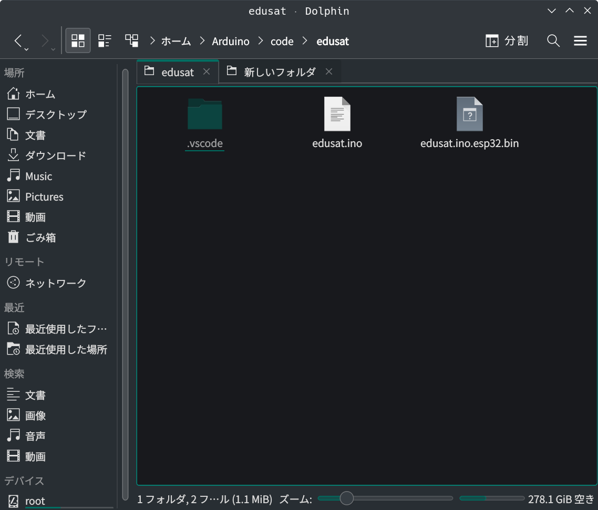
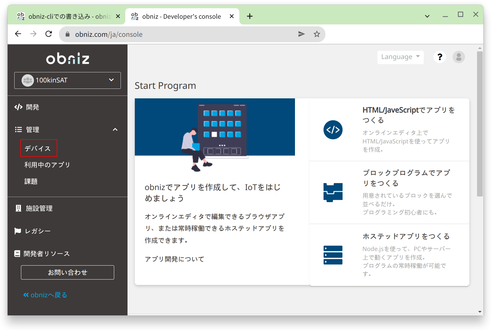
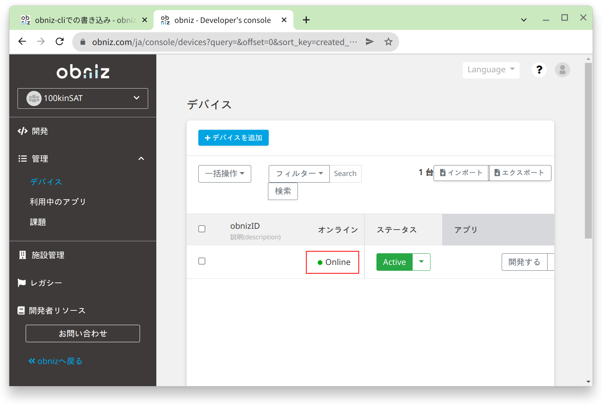
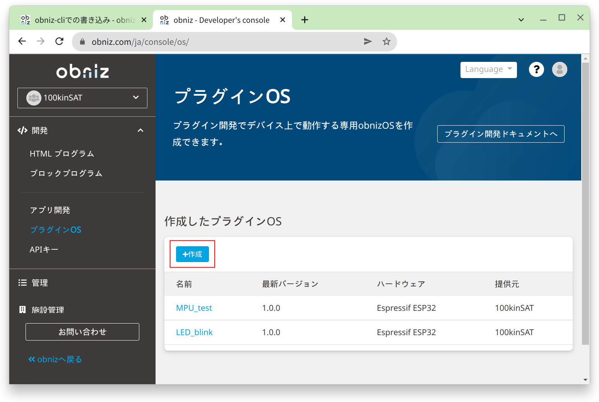
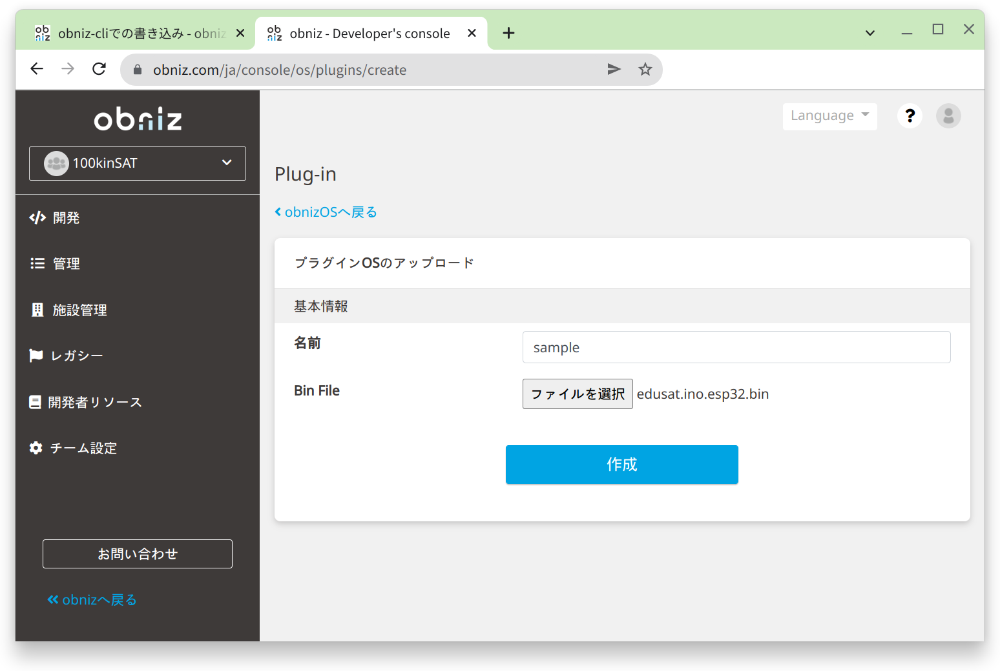
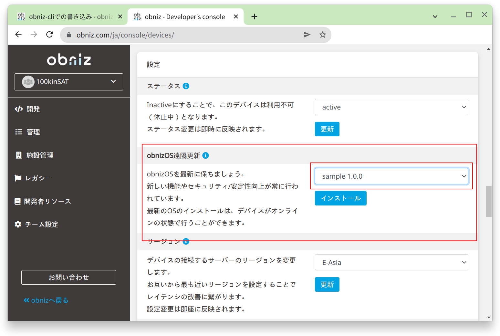

## プログラムを遠隔で書き込む

### 実行ファイルの生成

最初に、Arduino IDEで[edusat.ino](../../src/edusat/edusat.ino)を開きます。

次に、上部メニューの「ツール」から「ツール > ボード > obniz plugin > ESP32 Dev Module」を選択します。

そして、上部メニューの「スケッチ」から「スケッチ > コンパイルしたバイナリを出力」をクリックします。

サンプルプログラムがコンパイルされて、実行ファイル（`edusat.ino.esp32.bin`）が生成されます。
実行ファイルは`edusat.ino`と同じディレクトリに生成されます。

### 実行ファイルの書き込み

100kinSATの電源を入れます。

[開発者コンソール](https://obniz.com/ja/console)を開き、左メニューから「管理 > デバイス」をクリックします。

デバイスの画面で自分のデバイスがOnlineになっていることを確認します。

次に左メニューの「開発 > プラグインOS」をクリックします。

プラグインOSの画面で「+作成」をクリックします。

名前を入力して、実行ファイルの生成で作った実行ファイル（`edusat.ino.esp32.bin`）をアップロードします。

名前の入力とファイルの選択が完了したら「作成」をクリックします。

プラグインOSを作成したら、左メニューから「管理 > デバイス」をクリックしてデバイスの画面を開きます。

デバイスの画面を開いたら、自分のデバイスのobnizIDをクリックして、デバイスの詳細画面を開きます。

詳細画面を下にスクロールしていくと「obnizOS遠隔更新」という項目があるので、そこのプルダウンメニューから先程作成したプラグインOS「sample 1.0.0」を選択します。

「インストール」をクリックして100kinSATにプラグインOSのを書き込みます。

以上で遠隔での書き込みは完了です。
